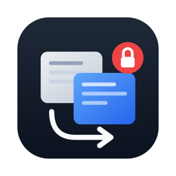
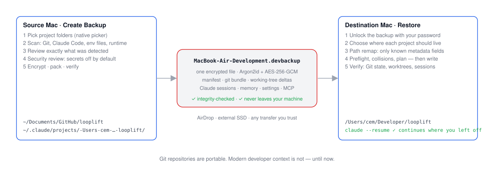
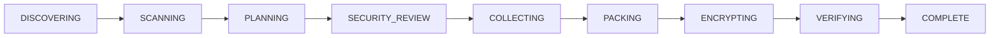
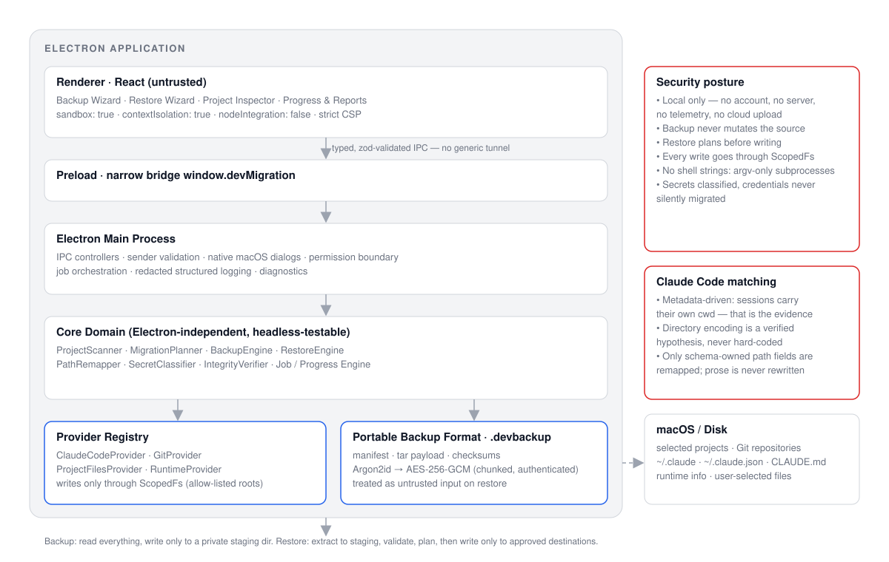

<p align="center">
  
</p>

<h1 align="center">Dev Migration Assistant</h1>

<p align="center">
  <strong>Migration Assistant, but for developers.</strong><br />
  <em>Your machine. Your code. Your context.</em>
</p>

<p align="center">
  <a href="https://github.com/CXBilen/dev-migration-assistant/actions/workflows/ci.yml"></a>
  <a href="https://github.com/CXBilen/dev-migration-assistant/releases"></a>
  <a href="LICENSE"></a>
  
  
  
</p>

An open-source macOS app that backs up the **real local state** of your active development projects into a single
encrypted `.devbackup` file and restores it on another Mac — with safe path remapping when your username or
project location changes.

<p align="center">
  <picture>
    <source media="(prefers-color-scheme: dark)" srcset="docs/assets/flow-dark.svg" />
    
  </picture>
</p>

> **Status:** v0.1 (pre-release) · macOS 13+ · Apple Silicon · local-only, no accounts, no telemetry.
> _Screenshots will be added once the UI is final._

**In 30 seconds**

- **Pick folders, not files.** Select the projects you are working on; the app discovers the Git state, Claude Code
  sessions, local config and env files that belong to them — and shows you the list before anything is written.
- **One encrypted file.** Everything is packed into a `.devbackup` you can AirDrop or copy to an SSD. Argon2id +
  AES-256-GCM, verified end-to-end after writing.
- **Restore where you like.** Choose a new location per project; known path references are remapped, worktrees are
  rebuilt, Claude Code sessions resume with `claude --resume`. Nothing is written before you approve the plan.

---

## The problem

Git repositories are portable. Modern developer context is not.

Moving to a new Mac today means cloning your repos again and then discovering everything that never lived in Git:

- the branch you were halfway through, with staged _and_ unstaged changes, untracked files and binaries;
- the three worktrees you had open for parallel work;
- weeks of **Claude Code** conversations, project memory, `CLAUDE.md` files, settings and MCP configuration;
- `.env.local`, `.nvmrc`, local tool config and the other files that make a checkout actually run.

Apple's Migration Assistant copies the whole disk and drags stale absolute paths, caches and credentials along.
`git push` only moves commits. Nothing in between captures _a project as you were working on it_.

## The solution

Dev Migration Assistant scans the project folders you pick, shows you exactly what it found, and captures:

| Area                    | What is captured                                                                                                                                                                         |
| ----------------------- | ---------------------------------------------------------------------------------------------------------------------------------------------------------------------------------------- |
| **Code state**          | Every commit, branch and tag as a Git bundle — restore works offline, no remote needed.                                                                                                  |
| **Git working state**   | Staged changes, unstaged changes, untracked files, binary changes, and every **worktree** (captured logically and rebuilt on the destination). Remotes are recorded and re-added.        |
| **AI coding context**   | Claude Code sessions/transcripts, auto-memory, user/project/local settings, `CLAUDE.md` hierarchy, MCP server configuration, prompt history, checkpoints (`file-history`) — per project. |
| **Local project state** | Selected env files (`.env.local` and friends — shown, classified, **off by default**), local tool config, and other untracked local files you choose.                                    |
| **Runtime facts**       | An informational `machine.json` (OS, architecture, tool versions such as git, node, claude) so the restore report can tell you what to install.                                          |

What is deliberately **not** captured: credentials (OAuth tokens, session keys, the macOS Keychain), machine-bound
caches, lock files and process registries. You re-authenticate on the new Mac; that is a feature.

## How it works

### Create Backup



1. Pick one or more project directories with the native macOS dialog.
2. Every provider (Claude Code, Git, project files, runtime) scans the selection **read-only** and reports what it found.
3. Review the artifacts. Sensitive items are excluded by default; credentials are never selectable.
4. Choose a password and an output path. The app stages the payload in a private directory, streams it through
   tar → chunked AES-256-GCM into the `.devbackup`, then re-reads the file and verifies every chunk and checksum.

**Backup never mutates the source.** Providers get read access everywhere but write access only inside their own
staging directory, enforced by a scoped filesystem facade.

### Restore Backup


1. Open the `.devbackup`, enter the password, and see the manifest (projects, sessions, sizes).
2. Map each project to its new location (defaults are suggested from your new home directory).
3. Review the **restore plan**: steps, preflight checks, path-remap report and every collision with an existing file
   or repository — each with a non-destructive default (`skip`).
4. Approve. Only then does the app write, and only inside the destinations you approved. It finishes with a
   verification report and an "attention" list (re-authenticate, install missing tools).

### The `.devbackup` format

A `.devbackup` is a single file: an unencrypted, authenticated header (magic `DEVBKP`, format version, Argon2id
parameters, wrapped master key) followed by a tar stream encrypted in fixed-size AES-256-GCM chunks. `manifest.json`
is the first entry of the payload and `checksums.json` the last, so restore can validate the manifest before touching
anything else and verify every file after extraction. Each chunk's nonce encodes its index and a last-chunk flag and
its additional authenticated data binds it to the header, so truncation, reordering, splicing and header tampering
all fail authentication. Everything streams — hashing, packing, encryption, decryption and extraction never load the
payload into memory. See [`docs/backup-format/DEVBACKUP_SPEC.md`](docs/backup-format/DEVBACKUP_SPEC.md) and
[ADR-0003](docs/architecture/adr/0003-devbackup-container.md).

### Path remapping

Moving from `/Users/alice/Documents/GitHub/app` to `/Users/alice.b/Code/app` changes every absolute path that Claude
Code and Git recorded. The app computes prefix-aware mappings (worktrees and sub-paths follow their project) and
providers rewrite **only known, schema-owned fields**: the `cwd` of transcript records, `~/.claude.json` project keys,
`history.jsonl` project entries, checkpoint metadata. Conversation text is never touched, even when it mentions the
old path, and Git worktrees are rebuilt from logical state rather than string-replaced. Anything the app does not
understand is preserved, reported and listed as an unsupported reference instead of being guessed. See
[ADR-0005](docs/architecture/adr/0005-path-remapping.md).

### Security model

Everything runs locally: no account, no server, no telemetry, no cloud upload. Backups are encrypted by default with a
password-derived key (**Argon2id**, memory-hard) protecting a random master key, and **AES-256-GCM** authenticating
every chunk of the payload. Secrets are **classified, not silently migrated**: `.env` files, MCP `env`/`headers` blocks
and transcripts that echoed a token are marked _sensitive_ and excluded until you opt in; **credentials are never
migrated** — you sign in again on the new machine. On restore the backup file is treated as untrusted input (validated
manifest, rejected `..`/absolute/link entries, size and count limits, checksums, fail closed), the Electron renderer
is sandboxed and isolated behind a typed IPC whitelist, and all writes go through a scoped filesystem bound to the
destinations you approved. Details: [`SECURITY.md`](SECURITY.md) and
[`docs/security/THREAT_MODEL.md`](docs/security/THREAT_MODEL.md).

## Why you can trust it

Trust should come from what you can verify, not from what a README promises. Every row below points at something you
can read or run.

| Principle                             | What it means in practice                                                                                                                                                    | Verify it yourself                                                                                                          |
| ------------------------------------- | ---------------------------------------------------------------------------------------------------------------------------------------------------------------------------- | --------------------------------------------------------------------------------------------------------------------------- |
| **Open source, MIT**                  | Every line that touches your data is in this repository. Build it yourself with `pnpm dist:mac`.                                                                             | [LICENSE](LICENSE), [Architecture](docs/architecture/ARCHITECTURE.md)                                                       |
| **Local only**                        | No account, no server, no telemetry, no cloud upload. The app itself makes no network requests.                                                                              | grep the code for `fetch(`/`https://` — the only ones open your browser at GitHub.                                          |
| **Encrypted by default**              | Password → Argon2id (memory-hard) → wraps a random master key → AES-256-GCM in authenticated chunks. Truncation, reordering and tampering fail closed.                       | [Backup format spec](docs/backup-format/DEVBACKUP_SPEC.md), `packages/archive/src/*.test.ts`                                |
| **Secrets are classified**            | `.env` files, MCP `env`/`headers`, private keys are detected and **off by default**. Credentials (OAuth tokens, Keychain items) are never migrated — you sign in again.      | `packages/core/src/security`, [Threat model](docs/security/THREAT_MODEL.md)                                                 |
| **Backup never mutates the source**   | Providers read everywhere but can only write inside their staging directory; the boundary is enforced by a scoped filesystem, not by convention.                             | `packages/shared/src/scoped-fs.ts` and its tests                                                                            |
| **Restore plans before writing**      | Every destination collision is listed with a non-destructive default. No write happens before you approve the plan, and writes only land inside the approved destinations.   | [ADR-0008](docs/architecture/adr/0008-restore-transactions-and-collisions.md)                                               |
| **Backups are untrusted input**       | Validated manifest, rejected `..`/absolute/symlink entries, size and count limits, checksums on every file.                                                                  | `packages/archive/src` extraction tests                                                                                     |
| **No hard-coded Claude internals**    | Sessions are matched by the `cwd` they record, the directory encoding is verified per machine, and only schema-owned path fields are rewritten — prose is never touched.     | [ADR-0004](docs/architecture/adr/0004-claude-project-matching.md), [ADR-0005](docs/architecture/adr/0005-path-remapping.md) |
| **A real migration is the test gate** | The automated suite builds a fake "Mac A", backs it up, restores it as a different user on a fake "Mac B" and asserts logical equivalence — Git, worktrees, sessions, prose. | `pnpm verify` (unit + integration), `pnpm test:e2e`                                                                         |

## Status

**v0.1** targets macOS on Apple Silicon. Provider status:

| Provider      | Status  | Notes                                                                                     |
| ------------- | ------- | ----------------------------------------------------------------------------------------- |
| Claude Code   | ✓ v0.1  | Sessions, memory, settings, `CLAUDE.md`, MCP config, history, checkpoints; safe remapping |
| Git           | ✓ v0.1  | Bundle + staged/unstaged/untracked/binary deltas; worktrees rebuilt; remotes re-added     |
| Project files | ✓ v0.1  | Env files and local config, classified; sensitive items opt-in                            |
| Runtime       | ✓ v0.1  | Tool versions recorded in `machine.json`; restore report lists what to install            |
| Codex CLI     | planned | v0.2 — see [roadmap](docs/ROADMAP.md)                                                     |
| Cursor        | planned | v0.2                                                                                      |
| VS Code       | planned | v0.2                                                                                      |
| Ghostty       | planned | after v0.2                                                                                |
| Homebrew      | planned | v0.3 (Brewfile-style manifest, reinstall on destination)                                  |

Known gaps for v0.1 are tracked honestly in [`docs/KNOWN_LIMITATIONS.md`](docs/KNOWN_LIMITATIONS.md).

## Requirements

- macOS 13 (Ventura) or newer, Apple Silicon (an Intel/universal build is on the [roadmap](docs/ROADMAP.md)).
- `git` on both machines (Xcode Command Line Tools or Homebrew).
- Claude Code installed on the destination if you want to resume sessions there (the app restores the files either way).

## Install

1. Download the latest `Dev Migration Assistant-<version>-arm64.dmg` from
   [Releases](https://github.com/CXBilen/dev-migration-assistant/releases).
2. Open the DMG and drag **Dev Migration Assistant** to `/Applications`.
3. **v0.1 builds are not signed or notarized.** macOS Gatekeeper will refuse to open the app on the first launch.
   Either:
   - Right-click (Control-click) the app in Finder and choose **Open**, then confirm; or, on macOS 15 and newer, open
     it once, then go to **System Settings → Privacy & Security** and click **Open Anyway**; or
   - remove the quarantine attribute from a terminal:
     ```sh
     xattr -d com.apple.quarantine "/Applications/Dev Migration Assistant.app"
     ```
   Signed and notarized releases are planned (see [`docs/release/RELEASE.md`](docs/release/RELEASE.md)). If you would
   rather not trust a downloaded binary, build it yourself with `pnpm dist:mac` (below).

The app is not App-Sandboxed (it has to read `~/.claude`, your repositories and env files, and run `git`). macOS may
ask for permission to access Desktop, Documents or removable volumes the first time you pick a folder there.

## Development

Prerequisites: Node 22 (`.nvmrc`), pnpm 11 (`corepack enable` picks up the version from `package.json`), git.

```sh
pnpm install          # install the workspace
pnpm dev              # run the Electron app with hot reload
pnpm verify           # typecheck + lint + format:check + unit + integration tests + build
pnpm test:e2e         # Playwright Electron E2E against the built app (pnpm build first, or use pnpm verify:e2e)
pnpm dist:mac         # unsigned arm64 DMG in apps/desktop/release/
```

Useful individual scripts: `pnpm typecheck`, `pnpm lint`, `pnpm format`, `pnpm test:unit`, `pnpm test:integration`.
Integration tests use real `git` in temporary directories and never touch your real `~/.claude` or repositories.
Contributor builds are unsigned (`CSC_IDENTITY_AUTO_DISCOVERY=false`); no Apple credentials are ever needed to work
on the project.

## Architecture

The full picture, including the reasoning behind each decision, lives in
[`docs/architecture/ARCHITECTURE.md`](docs/architecture/ARCHITECTURE.md) and the ADRs in
[`docs/architecture/adr/`](docs/architecture/adr/).

<p align="center">
  <picture>
    <source media="(prefers-color-scheme: dark)" srcset="docs/assets/architecture-dark.svg" />
    
  </picture>
</p>

<details>
<summary>Text version of the diagram</summary>

```text
┌──────────────────────────────────────────────────────────────┐
│                     ELECTRON APPLICATION                     │
│  Renderer / React  ── Backup Wizard · Restore Wizard ·       │
│                       Project Inspector · Progress + Reports │
│            │ typed, zod-validated IPC (no generic tunnel)    │
│  Preload   ── narrow contextBridge API: window.devMigration  │
│            │                                                 │
│  Main      ── IPC controllers · native dialogs · permission  │
│               boundary · job bridge · logging · diagnostics  │
│            │                                                 │
│  Core      ── ProjectScanner · MigrationPlanner ·            │
│               BackupEngine · RestoreEngine · PathRemapper ·  │
│               SecretClassifier · IntegrityVerifier · Jobs    │
│         ┌──────┴────────┐          ┌──────────────────────┐  │
│         │ Providers     │          │ Archive (.devbackup) │  │
│         │ claude-code   │          │ manifest · payload   │  │
│         │ git           │          │ checksums · AES-GCM  │  │
│         │ project-files │          │ Argon2id · hardening │  │
│         │ runtime       │          └──────────────────────┘  │
│         └───────────────┘                                    │
└──────────────────────────────────────────────────────────────┘
                     macOS / Disk (read on backup, written on restore only through ScopedFs)
```

</details>

Monorepo layout: `packages/model` (zod domain model), `packages/shared` (paths, `ScopedFs`, `Exec`, redaction,
logger), `packages/archive` (the container), `packages/core` (provider contract, engines, jobs),
`packages/providers/*` (one package per provider), `packages/ipc-contracts`, `packages/test-utils`, `apps/desktop`
(Electron main / preload / React renderer), `tests/e2e` (Playwright).

## Documentation

| Document                                                   | What it covers                                                                                |
| ---------------------------------------------------------- | --------------------------------------------------------------------------------------------- |
| [User guide](docs/USER_GUIDE.md)                           | The real Mac → Mac procedure, verification, re-auth, troubleshooting                          |
| [Architecture](docs/architecture/ARCHITECTURE.md)          | Packages, flows, non-negotiable rules, testing strategy                                       |
| [ADRs](docs/architecture/adr/)                             | Stack, provider contract, container, matching, remapping, Git, Electron, restore transactions |
| [Backup format spec](docs/backup-format/DEVBACKUP_SPEC.md) | Byte layout of `.devbackup`                                                                   |
| [Threat model](docs/security/THREAT_MODEL.md)              | Assets, trust boundaries, attacker models, threat → mitigation table                          |
| [Provider authoring](docs/providers/AUTHORING.md)          | How to add a provider (with a `CodexProvider` skeleton)                                       |
| [Release process](docs/release/RELEASE.md)                 | Versioning, changelog, release workflow, signing                                              |
| [Roadmap](docs/ROADMAP.md)                                 | v0.2 / v0.3 / v1 scope                                                                        |
| [Known limitations](docs/KNOWN_LIMITATIONS.md)             | What v0.1 does not do                                                                         |
| [Research notes](docs/research/)                           | Claude Code storage, container crypto, Electron security                                      |

## Contributing

Contributions are welcome — new providers most of all. Read [`CONTRIBUTING.md`](CONTRIBUTING.md) for the
development workflow, the hard rules (no shell strings, no writes outside `ScopedFs`, no `any`, tests are not
optional) and how to run the verification suite. Please follow the [Code of Conduct](CODE_OF_CONDUCT.md).

## Security

Found a vulnerability? Please **do not** open a public issue. See [`SECURITY.md`](SECURITY.md) for the reporting
process and what is in scope.

## License

[MIT](LICENSE) © 2026 Cem Bilen
